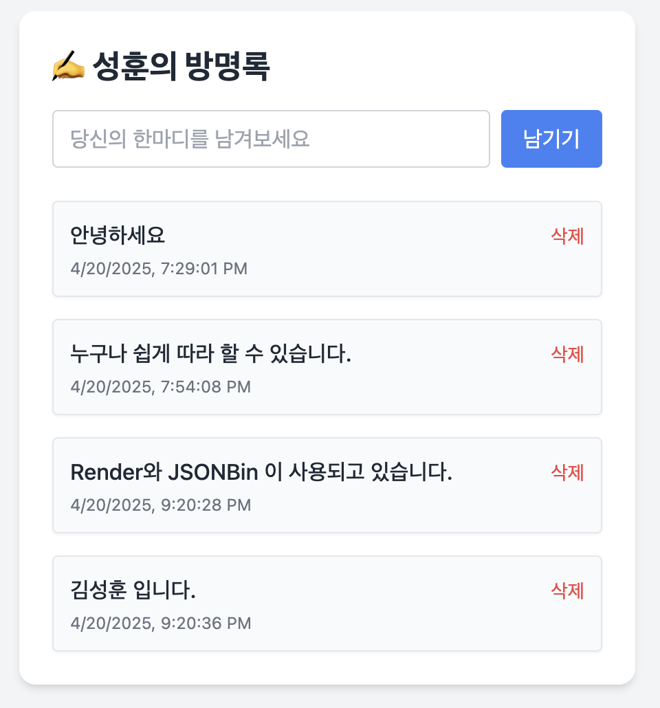

# ✍️ 개인 프로젝트 – 성훈의 방명록

## 🛠 기술 스택

- 백엔드:    
- 프론트엔드: 
- 호스팅: 

## 📋 프로젝트 개요

| 이름   | 프로젝트명       | 배포 링크                                              | 코드 보기                                                                 |
|--------|------------------|---------------------------------------------------------|---------------------------------------------------------------------------|
| 김성훈 | ✍️ 성훈의 방명록 | [https://muffler.onrender.com](https://muffler.onrender.com) | [GitHub](https://github.com/tony96kimsh/muffler/tree/main/6week)         |

‘누구나 쓸 수 있는 메모장’에서 출발해,  
이제는 **나와 연결되는 사람들이 한마디 남길 수 있는 방명록 서비스**로 발전시킨 프로젝트입니다.

- 이름과 메시지를 남기면 클라우드에 저장되고, 실시간으로 렌더링되어 확인할 수 있습니다.
- 로그인 없이 누구나 자유롭게 작성 가능하여 **열린 커뮤니케이션 공간**을 지향합니다.

## 💡 주요 기능 요약

- **글 남기기 & 삭제 기능** (실시간 반영)
- **JSONBin을 이용한 외부 DB-like 저장**
- **EJS 기반 템플릿 구성**으로 깔끔한 UI 구성
- **Axios로 RESTful API 연동** 및 JSON 처리
- **Render를 통한 서버 배포 & 접근 가능 웹서비스 구성**

 

---
 

# 🚀 그룹 스터디 활동 **"Code Muffler"**

 | 
--|--|

> **기간**: 2024년 3월 20일 ~ 4월 24일 (총 6주)  
> **구성**: 기본 개념 스터디 5주 + 개별 프로젝트 1주  
> **인원**: 총 6명

## ✨ 스터디 목표

Node.js의 기본 개념과 주요 모듈(fs, http, npm, express 등)을 팀과 함께 학습하고,  
기초 실습 및 회고를 통해 백엔드 개발에 대한 이해도를 높이는 것이 목표입니다.

## 🧑‍💻 멤버 소개

| 이름 | GitHub | 이메일 |
| ---- | ------ | ------ |
| 김성훈 | [tony96kimsh/muffler](https://github.com/tony96kimsh/muffler) | [tony96kimsh@gmail.com](mailto:tony96kimsh@gmail.com) |
| 김민혁 | [kmh8405](https://github.com/kmh8405/) | [kmh.ssem8405@gmail.com](mailto:kmh.ssem8405@gmail.com) |
| 최영비 | [cyeongb/SAMPLE_CODE](https://github.com/cyeongb/SAMPLE_CODE) | [yaong726yaong@gmail.com](mailto:yaong726yaong@gmail.com) |
| 홍민경 | [mkhong210](https://github.com/mkhong210) | [ghdalsrud210@gmail.com](mailto:ghdalsrud210@gmail.com) |
| 허유경 | [HYK-Nov/code-muffler](https://github.com/HYK-Nov/code-muffler) | [yundori97@gmail.com](mailto:yundori97@gmail.com) |
| 황호선 | [HOSEONH](https://github.com/HOSEONH) | [hoseonh22@gmail.com](mailto:hoseonh22@gmail.com) |

---

## 📅 주간 스터디 기록

> 📂 [스터디 그룹 Notion Workspace](https://www.notion.so/Muffler_NodeJS-Study-1cbae42089d880d79a32eedf5aef5771?pvs=21)

### 🔹 0주차 — 스터디 모집 및 구성
- [스터디 소개 및 모집 페이지](https://lateral-tractor-58e.notion.site/Code-Muffler-1cbae42089d881f4817ac2a5662ac3e2?pvs=4)
- [OT 발표 슬라이드](https://docs.google.com/presentation/d/16ncXqW8z4w_HK2ErmDuCDR46KaLaOKmDirY6H76vICc/edit#slide=id.g332a8289270_0_1635)
- [김성훈 0주차 기록](https://www.notion.so/1-1cbae42089d881d7b748f0e08160edf8?pvs=21)

### 🔹 1주차 — `fs` 모듈 / 자바스크립트 비동기·동기 처리
- [김성훈 1주차 정리](https://www.notion.so/1cbae42089d881c4a465cb16d01074b7?pvs=21)

### 🔹 2주차 — `http` 모듈
- [김성훈 2주차 정리](https://www.notion.so/1-1cbae42089d881a99c84ce7662530382?pvs=21)

### 🔹 3주차 — fs + http 개인 리뷰 (※ 수업 프로젝트 병행으로 기록 생략)

### 🔹 4주차 — `npm` 개념 정리
- [김성훈 4주차 정리](https://www.notion.so/1cbae42089d880978923f8ee496f5a2b?pvs=21)

### 🔹 5주차 — `Express.js` 실습 & 스터디 회고
- [김성훈 5주차 정리](https://www.notion.so/1d2ae42089d880e1b396c0a3490a9ead?pvs=21)

### 🔹 6주차 — 개인 프로젝트 (자유 주제 기반 실습)

| 이름   | 프로젝트명       | 배포 링크                                              | 코드 보기                                                                 |
|--------|------------------|---------------------------------------------------------|---------------------------------------------------------------------------|
| 김성훈 | ✍️ 성훈의 방명록 | [https://muffler.onrender.com](https://muffler.onrender.com) | [GitHub](https://github.com/tony96kimsh/muffler/tree/main/6week)         |

> 단순한 메모 앱에서 확장하여, 누구나 방문해 메시지를 남길 수 있는 **웹 방명록 서비스**로 구현한 프로젝트입니다.  
> Express 기반 서버와 JSONBin을 활용해 클라우드에 메시지를 저장하고,  
> EJS 템플릿으로 실시간 렌더링 UI를 구성했습니다.  

- Axios를 활용한 비동기 HTTP 통신 처리  
- 환경변수 기반 API 키 보호 및 깃허브 자동 배포 연동  
- Render 배포를 통해 누구나 접속 가능한 **공개형 방명록 서비스** 제공

---

## 🧭 스터디 방식

- 매주 목요일 19:00 ~ 21:00 대면 스터디 진행
- 각자 사전 과제를 준비하고, 주제 발표 및 실습 중심
- 회고를 통해 학습 내용과 팀 협업 경험을 정리

---

## 🙌 마무리 한마디

> 5주간 함께한 코드 머플러 팀원들과의 학습 여정이 단순한 기술 습득을 넘어서  
> 서로 배우고 성장하는 시간으로 이어지길 기대합니다.

- ref: <a href="https://www.flaticon.com/kr/free-icons/" title="편지 아이콘">(개인프로젝트 파비콘) 편지 아이콘 제작자: Freepik - Flaticon</a>
